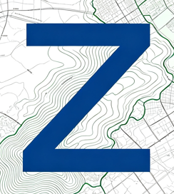

# Zonea — Inteligência Territorial

**Informação urbanística direto da fonte.** Consulte. Compreenda. Planeje.

---

## O que é o Zonea?

O **Zonea** ajuda você a encontrar, rapidamente, os dados oficiais de mapas e zoneamento de um município — sem precisar caçar em dezenas de sites diferentes de prefeitura.

Cada prefeitura da Região Metropolitana de Belo Horizonte (RMBH) tem seu próprio "geoportal" (o site onde ela publica mapas, zoneamento e informações do território), e esses portais são difíceis de achar e nem sempre funcionam bem. O Zonea funciona como um **ponto de partida único**: você digita o nome do município e ele te leva direto para a fonte oficial correta — sem inventar dados, sem substituir a prefeitura, só facilitando o caminho até lá.

* **Onde atuamos hoje:** Região Metropolitana de Belo Horizonte (RMBH), 34 municípios.
* **O que já está confirmado:** 6 desses municípios têm o portal e o sistema de coordenadas verificados por nós (Belo Horizonte, Betim, Contagem, Nova Lima, Ribeirão das Neves e Santa Luzia). Os outros ainda estão em processo de checagem.
* **Para quem é:** arquitetos, engenheiros, urbanistas, e qualquer pessoa que precise consultar informações territoriais de um município da região.

---

## O que dá pra fazer no site hoje

* **Buscar um município e ir direto à fonte oficial** — digite o nome (o campo até corrige acentos e maiúsculas/minúsculas) e o Zonea mostra o link confirmado do geoportal daquela cidade, junto com um resumo do que tem disponível lá.
* **Saber se o dado é confiável** — cada resultado mostra se o portal já foi auditado por nós ("Fonte Auditada") ou se ainda está em fase de checagem ("Busca Direta"). E se um portal cair fora do ar, o Zonea avisa isso na tela, em vez de simplesmente te mandar para um link quebrado.
* **Aprender os termos técnicos** — uma página de glossário explica, em linguagem simples, conceitos como WMS, WFS, Datum, SIRGAS 2000 e outros termos que aparecem nos portais de geoprocessamento.
* **Desenhar uma poligonal automaticamente** — nossa ferramenta mais nova. Em vez de desenhar manualmente num programa de CAD, você preenche uma tabela (ou cola direto de uma planilha Excel) com as coordenadas do terreno, e o Zonea desenha o formato, calcula a área, o perímetro e avisa se algo não fechou certo.
* **Falar com a gente pelo WhatsApp** — direto em qualquer página, para tirar dúvidas, sugerir um município novo, ou avisar se algo está fora do ar.

Algumas páginas do site (a busca principal e a ferramenta de poligonal) pedem uma chave de acesso — é só pedir pra nossa equipe pelo WhatsApp.

---

## Como o site foi construído (para quem for mexer no código)

O Zonea é um site simples de propósito: só HTML, CSS e JavaScript "puros", sem nenhum framework nem etapa de compilação. Isso significa que qualquer editor de texto e um navegador já bastam para trabalhar nele.

* As informações dos municípios ficam num arquivo separado (`data/municipios.json`), fora do código da página — assim dá pra atualizar os dados sem mexer no visual do site.
* O visual (cores, fontes, espaçamentos) é centralizado num único arquivo de estilo (`css/estilo.css`), então mudar a identidade visual do site inteiro é uma questão de editar um lugar só.
* Cada página carrega os dados dinamicamente ao abrir — por isso não dá pra simplesmente abrir os arquivos `.html` clicando duas vezes; é preciso rodar um servidor local (explicado mais abaixo).

---

## Mapa dos arquivos do projeto

```text
/
├── index.html         # Página principal — busca de municípios (pede chave de acesso)
├── servicos.html      # Sobre o Zonea, casos de uso e ativação de acesso
├── conhecimento.html  # Glossário com os termos técnicos explicados
├── poligonal.html     # Ferramenta que desenha a poligonal automaticamente (pede chave de acesso)
├── faq.html           # Perguntas frequentes
├── css/
│   └── estilo.css     # Todo o visual do site (cores, fontes, layout)
├── js/
│   ├── script.js      # Busca, menu, chave de acesso e outras funções gerais
│   └── poligonal.js   # Lógica da ferramenta de poligonal (cálculos e desenho)
├── data/
│   ├── municipios.json  # Lista dos 34 municípios e seus dados
│   └── config.json      # Configurações gerais (ex: número do WhatsApp)
├── img/                # Logo, ícones e imagens
└── README.md           # Este arquivo
```

---

## Como rodar o site no seu computador

O site busca os dados de município num arquivo separado enquanto a página carrega. Por causa disso, **não dá pra simplesmente abrir o arquivo `.html` clicando duas vezes** — o navegador bloqueia esse tipo de carregamento por segurança. É preciso "servir" a pasta com um servidor local simples. Duas opções fáceis:

```bash
# Se você tem Python instalado
python -m http.server 8000

# Ou, com Node.js, sem precisar instalar nada
npx serve .
```

Depois, acesse `http://localhost:8000/servicos.html` no navegador (a página principal e a ferramenta de poligonal pedem uma chave de acesso — peça uma à equipe).

---

## Para onde o projeto está indo

1. **Fase 1 — Base:** estrutura do site e catálogo dos municípios da RMBH. ✅
2. **Fase 2 — Dados confiáveis:** conferir e validar os portais de cada município. *(em andamento)*
3. **Fase 3 — Mapas:** mostrar mapas e camadas geográficas dentro do próprio Zonea.
4. **Fase 4 — Busca avançada:** encontrar informações por endereço, CEP ou número de lote.
5. **Fase 5 — Inteligência territorial:** cruzar dados de diferentes fontes e gerar relatórios automáticos.
6. **Fase 6 — Expansão:** levar o Zonea para outras regiões do Brasil, além da RMBH.

---

## Contato

Desenvolvido por **[Luiz Gustavo](https://www.luizgustavodev.com/)**.

Dúvidas, parcerias ou sugestões? Fale com a gente pelo WhatsApp disponível em qualquer página do site.

📍 Belo Horizonte / MG
