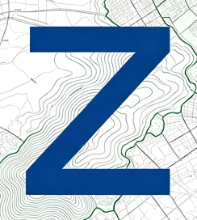

# Zonea — Inteligência Territorial

**Informação urbanística direto da fonte.** Consulte. Compreenda. Planeje.

🔗 [zonea.com.br](https://zonea.com.br)

---

## O que é o Zonea?

O **Zonea** ajuda você a encontrar, rapidamente, os dados oficiais de mapas e zoneamento de um município — sem precisar caçar em dezenas de sites diferentes de prefeitura.

Cada prefeitura da Região Metropolitana de Belo Horizonte (RMBH) tem seu próprio "geoportal" (o site onde ela publica mapas, zoneamento e informações do território), e esses portais são difíceis de achar e nem sempre funcionam bem. O Zonea funciona como um **ponto de partida único**: você digita o nome do município, clica nele num mapa ou lê um guia prático — e ele te leva direto para a fonte oficial correta, sem inventar dados, sem substituir a prefeitura, só facilitando o caminho até lá.

* **Onde atuamos hoje:** Região Metropolitana de Belo Horizonte (RMBH), 34 municípios.
* **O que já está confirmado:** 6 desses municípios têm o portal e o sistema de coordenadas verificados por nós (Belo Horizonte, Betim, Contagem, Nova Lima, Ribeirão das Neves e Santa Luzia). Os outros ainda estão em processo de checagem.
* **Para quem é:** arquitetos, engenheiros, urbanistas, e qualquer pessoa que precise consultar informações territoriais de um município da região.

---

## O que dá pra fazer no site hoje

* **Buscar um município e ir direto à fonte oficial** — digite o nome (o campo até corrige acentos e maiúsculas/minúsculas) e o Zonea mostra o link confirmado do geoportal daquela cidade, junto com um resumo do que tem disponível lá.
* **Explorar o mapa da RMBH** — um mapa interativo (Leaflet + malha oficial do IBGE) com o contorno dos 34 municípios. Clique em qualquer um pra ver o mesmo card de dados da busca e ir direto ao portal da prefeitura.
* **Saber se o dado é confiável** — cada resultado mostra se o portal já foi auditado por nós ("Fonte Auditada") ou se ainda está em fase de checagem ("Busca Direta"). E se um portal cair fora do ar, o Zonea avisa isso na tela, em vez de simplesmente te mandar para um link quebrado.
* **Aprender os termos técnicos e a prática** — a Central de Conhecimento reúne um glossário (WMS, WFS, Datum, SIRGAS 2000 e outros termos que aparecem nos portais de geoprocessamento) e artigos práticos, como calcular área/perímetro de uma poligonal a partir de azimute e distância, o que é erro de fechamento e como corrigi-lo, e o que é um memorial descritivo.
* **Desenhar uma poligonal automaticamente** — em vez de desenhar manualmente num programa de CAD, você preenche uma tabela (ou cola direto de uma planilha Excel) com as coordenadas do terreno, e o Zonea desenha o formato, calcula a área, o perímetro e avisa se algo não fechou certo.
* **Falar com a gente pelo WhatsApp** — direto em qualquer página, para tirar dúvidas, sugerir um município novo, ou avisar se algo está fora do ar.

A busca de município, o mapa e os artigos são **100% gratuitos**, sem precisar de conta — os dados dos municípios são públicos e vêm das próprias prefeituras. O que é pago é a **Ferramenta de Poligonal**: as **2 primeiras poligonais são grátis** (basta criar uma conta gratuita em `conta.html`) e, depois disso, é preciso assinar (Pix, boleto ou cartão, via Mercado Pago).

---

## Como o site foi construído (para quem for mexer no código)

O Zonea é um site simples de propósito: só HTML, CSS e JavaScript "puros", sem nenhum framework nem etapa de compilação. Isso significa que qualquer editor de texto e um navegador já bastam para trabalhar nele.

* As informações públicas dos municípios ficam num arquivo separado (`data/municipios.json`), fora do código da página — assim dá pra atualizar os dados sem mexer no visual do site.
* O visual (cores, fontes, espaçamentos) é centralizado num único arquivo de estilo (`css/estilo.css`), então mudar a identidade visual do site inteiro é uma questão de editar um lugar só.
* Cada página carrega os dados dinamicamente ao abrir — por isso não dá pra simplesmente abrir os arquivos `.html` clicando duas vezes; é preciso rodar um servidor local (explicado mais abaixo). Todos os links internos gerados por JavaScript usam caminho absoluto a partir da raiz (ex. `/conta.html`), pra funcionar tanto nas páginas do primeiro nível quanto nas de dentro de `conhecimento/`.
* **Login e assinatura** são feitos com [Supabase](https://supabase.com) (banco de dados + autenticação gerenciados) — `js/supabase-client.js` inicializa a conexão (a chave usada ali é pública por design, protegida por Row Level Security no banco, não pelo sigilo dela) e `js/auth.js` cuida do cadastro/login/logout/pagamento na página `conta.html`. Só a Poligonal depende disso: busca, mapa e artigos funcionam mesmo com o Supabase fora do ar.
* **Dados dos municípios** (link do portal, sistema, detalhes técnicos, sistema de referência, status de disponibilidade) ficam todos em `data/municipios.json`, um arquivo estático e público — não há mais nenhuma consulta a banco pra buscar ou mostrar um município.
* As tabelas e Edge Functions da antiga trava por município (`municipios_protegido`, `anon_preview_usado`, `leads_interesse`, `get-preview-municipio`, `submit-lead`) **não são mais usadas pelo site** e ficam no repositório só como histórico, até serem desativadas no Supabase.
* A **Poligonal** (`poligonal.html`) exige **conta logada**; quem decide se a pessoa ainda pode calcular é a Edge Function `usar-poligonal`. As 2 primeiras poligonais de cada conta são grátis; depois, só assinante ativo. O crédito é gasto no primeiro "Fechar Poligonal e Calcular" de cada poligonal (recalcular a mesma poligonal, com o mesmo ponto inicial, não gasta outro; "Limpar Tudo" começa uma nova). O contador vive em `profiles.poligonais_gratis_usadas` e é incrementado de forma atômica pela função SQL `consumir_poligonal_gratis` (só a `service_role` consegue chamá-la) — o limite fica numa constante só, `LIMITE_POLIGONAIS_GRATIS`, na Edge Function. O desenho ao vivo enquanto a pessoa digita é livre; o crédito controla o resultado (área, perímetro e erro de fechamento).
* **Pagamento** é via Mercado Pago (Checkout Pro), sem servidor próprio: `conta.html` chama a Edge Function `create-mp-preference` (Supabase) pra gerar o link de pagamento, e a Edge Function `mp-webhook` recebe a confirmação do Mercado Pago e ativa a assinatura automaticamente — ver `supabase/functions/`.
* **Mapa** (`mapa.html` + `js/mapa.js`): usa [Leaflet](https://leafletjs.com) sobre tiles do OpenStreetMap e uma malha de limites municipais derivada de dados abertos do IBGE (`data/rmbh-municipios.geojson`). Reaproveita a mesma função de renderização de card da busca (`renderMunicipioCard`, em `js/script.js`), então o comportamento de acesso é idêntico nos dois lugares.

---

## Mapa dos arquivos do projeto

```text
/
├── index.html         # Página principal — busca de municípios (livre)
├── mapa.html           # Mapa interativo dos 34 municípios da RMBH (livre)
├── servicos.html      # Sobre o Zonea, casos de uso e chamada para criar conta
├── conhecimento.html  # Glossário técnico + índice dos artigos práticos
├── conhecimento/
│   ├── calcular-area-perimetro-poligonal.html   # Guia: azimute/distância → coordenadas, área e perímetro
│   ├── erro-fechamento-poligonal.html           # Guia: o que é erro de fechamento e como corrigir
│   └── memorial-descritivo.html                 # Guia: o que é um memorial descritivo e quando é exigido
├── poligonal.html     # Ferramenta que desenha a poligonal automaticamente (2 grátis por conta, depois assinatura)
├── faq.html           # Perguntas frequentes
├── conta.html          # Cadastro, login e status da assinatura
├── css/
│   └── estilo.css     # Todo o visual do site (cores, fontes, layout)
├── js/
│   ├── script.js            # Busca, menu, guard de páginas restritas e outras funções gerais
│   ├── mapa.js               # Lógica do mapa interativo (Leaflet + malha do IBGE)
│   ├── poligonal.js         # Lógica da ferramenta de poligonal (cálculos e desenho)
│   ├── supabase-client.js   # Inicialização do client Supabase (usado em toda página)
│   └── auth.js               # Cadastro/login/logout, usado só em conta.html
├── data/
│   ├── municipios.json         # Os 34 municípios: dados públicos + portal oficial auditado de cada um
│   ├── config.json             # Configurações gerais (ex: número do WhatsApp)
│   └── rmbh-municipios.geojson # Malha dos limites dos 34 municípios (derivada de dados abertos do IBGE)
├── supabase/
│   ├── migrations/
│   │   ├── 0001_init.sql                     # Schema inicial (tabelas + Row Level Security)
│   │   ├── 0002_preview_gratis.sql           # (em desuso) Tabela da antiga consulta gratuita por dispositivo
│   │   ├── 0003_leads_interesse.sql          # (em desuso) Tabela da antiga captura de contato
│   │   ├── 0004_mapa_demo_bh.sql             # (em desuso) Flag is_demo da antiga regra "Belo Horizonte grátis"
│   │   └── 0005_poligonais_gratis.sql        # Contador de poligonais grátis por conta + função atômica de consumo
│   └── functions/
│       ├── create-mp-preference/index.ts     # Gera o link de pagamento (Mercado Pago Checkout Pro)
│       ├── usar-poligonal/index.ts           # Controla o uso da Poligonal: 2 grátis por conta, depois assinatura
│       ├── mp-webhook/index.ts               # Recebe a confirmação de pagamento e ativa a assinatura
│       ├── get-preview-municipio/index.ts    # (em desuso) Antiga consulta gratuita por visitante
│       └── submit-lead/index.ts              # (em desuso) Antigo registro de contato
├── scripts/
│   └── migrate-municipios.mjs    # Script histórico da migração inicial (Fase 2) — hoje desatualizado: lê
│                                    # link/sistema/detalhes_tecnicos de data/municipios.json, campos que
│                                    # já não existem mais lá (viraram exclusivos do Supabase). Mantido só
│                                    # como referência de como o schema foi populado a primeira vez.
├── .github/workflows/
│   └── mirror-hostinger.yml      # Espelha automaticamente todo push em main pro repositório de deploy
├── robots.txt          # Diretivas de indexação para buscadores
├── sitemap.xml          # Mapa do site para SEO
├── img/                # Logo, ícones e imagens
├── marketing/          # Material de divulgação — não faz parte do site em si
│   ├── prints/          # Capturas de tela para redes sociais
│   ├── story-export/    # Stories exportados (Instagram)
│   ├── ads/              # Conceitos de anúncio (Design Canvas — .dc.html editáveis + PNGs finais)
│   └── ad-assets/        # Material de apoio dos anúncios (recortes de tela, variações de logo)
└── README.md           # Este arquivo
```

---

## Como rodar o site no seu computador

O site busca os dados de município num arquivo separado enquanto a página carrega. Por causa disso, **não dá pra simplesmente abrir o arquivo `.html` clicando duas vezes** — o navegador bloqueia esse tipo de carregamento por segurança. É preciso "servir" a pasta com um servidor local simples. Duas opções fáceis:

```bash
# Se você tem Python instalado
python -m http.server 8000

# Ou, com Node.js, sem precisar instalar nada
npx serve .
```

Depois, acesse `http://localhost:8000/servicos.html` no navegador (busca, mapa e artigos são livres; a ferramenta de poligonal exige assinatura ativa — crie uma conta em `conta.html`).

---

## Deploy

O site é hospedado na Hostinger. O fluxo é: você trabalha e dá push neste repositório (`zonea`) — o workflow `.github/workflows/mirror-hostinger.yml` espelha automaticamente todo push na branch `main` para um segundo repositório (`zonea-hostinger`), que é o que a Hostinger está de fato conectada para publicar. Não existe build nem deploy manual: um `git push` aqui já é suficiente pro site novo ir ao ar.

---

## Para onde o projeto está indo

1. **Fase 1 — Base:** estrutura do site e catálogo dos municípios da RMBH. ✅
2. **Fase 2 — Dados confiáveis:** conferir e validar os portais de cada município. *(em andamento — 6 de 34 confirmados)*
3. **Fase 3 — Mapas:** visor interativo com os limites dos 34 municípios. ✅ *(camadas de zoneamento/WMS sobrepostas ainda não — ver Fase 5)*
4. **Fase 4 — Busca avançada:** encontrar informações por endereço, CEP ou número de lote.
5. **Fase 5 — Inteligência territorial:** camadas geográficas (WMS/WFS) sobre o mapa, cruzamento de dados de diferentes fontes e relatórios automáticos.
6. **Fase 6 — Expansão:** levar o Zonea para outras regiões do Brasil, além da RMBH.

---

## Contato

Desenvolvido por **[Luiz Gustavo](https://www.luizgustavodev.com/)**.

Dúvidas, parcerias ou sugestões? Fale com a gente pelo WhatsApp disponível em qualquer página do site.

📍 Belo Horizonte / MG
